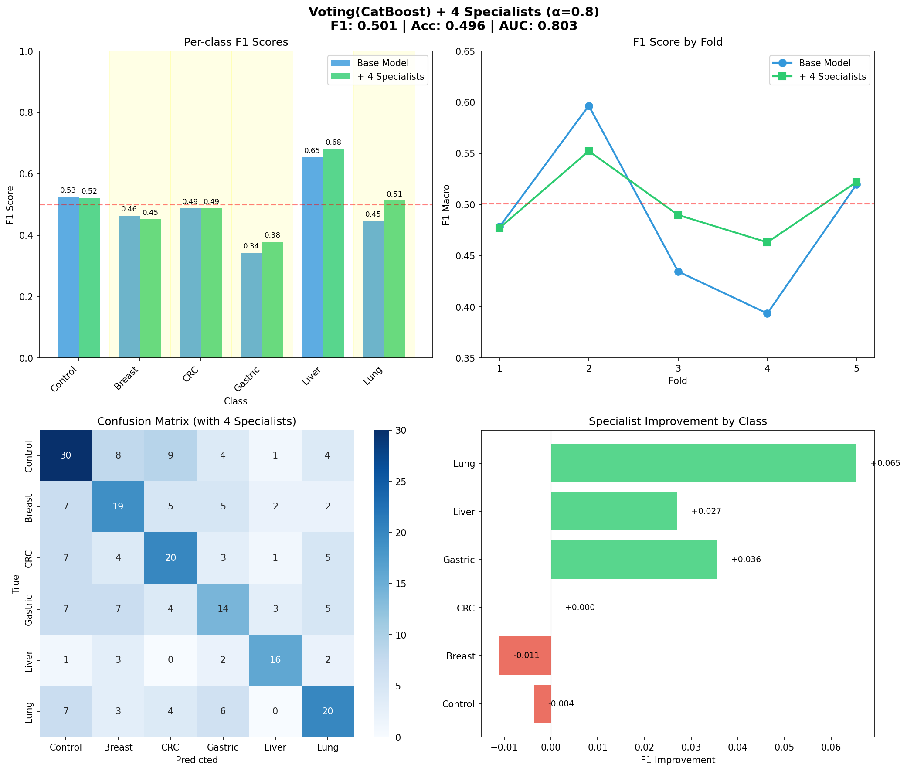

# Q5. Data Analysis and Machine Learning Model Construction (7 points)

## 📋 Overview

Complete machine learning pipeline for **cfDNA (cell-free DNA) fragmentomics classification** to detect cancer types from blood samples.

---

## 📁 File Structure

```
q5_solution/
├── README.md                      # This file
└── src/
    ├── stage0_prepare.py          # Data loading & preparation
    ├── stage1_qc.py               # Quality control & preprocessing
    ├── stage2_feature_selection.py    # Feature selection (VIP, stability)
    ├── stage2_group_pca_direct.py     # Group-aware PCA
    ├── model_pipeline.py          # Unified model training pipeline
    └── model_pipeline_viz.py      # Model training with visualization
```

---

## 📊 Dataset Description

**Source**: cfDNA fragmentomics data from cancer patients and healthy controls.

### Class Distribution
| Class | Samples | Percentage |
|-------|---------|------------|
| Control (Healthy) | 70 | 23.3% |
| Breast Cancer | 50 | 16.7% |
| CRC (Colorectal) | 50 | 16.7% |
| Gastric | 50 | 16.7% |
| Liver | 30 | 10.0% |
| Lung | 50 | 16.7% |
| **Total** | **300** | **100%** |

### Feature Groups
| Group | Description | Features |
|-------|-------------|----------|
| EM | End Motif patterns (4-mer DNA sequences) | 256 |
| FLEN | Fragment Length distribution (50-350 bp) | 301 |
| NUCLEOSOME | Nucleosome positioning around TSS | 601 |
| **Total** | | **1,158** |

---

## 🔄 Pipeline Architecture

```
Stage 0: Data Preparation (stage0_prepare.py)
    • Load CSV files, transpose, extract labels
    ↓
Stage 1: Quality Control (stage1_qc.py)
    • Train/Test split (80/20, stratified)
    • Zero-variance filter → -9 features
    • Correlation filter (r>0.90) → -608 features
    • StandardScaler (fit on TRAIN only)
    └── Result: 1,158 → 541 features
    ↓
Stage 2: Feature Selection
    • stage2_feature_selection.py: VIP + Stability Selection
    • stage2_group_pca_direct.py: Group-aware PCA
    └── Result: 541 → 15 features (98.7% reduction)
    ↓
Stage 3: Model Training & Evaluation
    • model_pipeline.py: Individual models & ensembles
    • model_pipeline_viz.py: With visualization output
```

---

## 🚀 Quick Start

### Prerequisites
```bash
pip install numpy pandas scikit-learn xgboost catboost matplotlib seaborn
```

### Run the Pipeline
```bash
cd q5_solution

# Run data pipeline (if data not preprocessed)
python src/stage0_prepare.py
python src/stage1_qc.py
python src/stage2_group_pca_direct.py

# Train & evaluate best model (4 Specialists)
python src/model_pipeline.py --voting-catboost-specialist --4spec --alpha 0.8
```

### Model Options
```bash
# Individual models
python src/model_pipeline_viz.py --lr              # Logistic Regression
python src/model_pipeline_viz.py --catboost        # CatBoost

# Voting ensembles
python src/model_pipeline_viz.py --voting              # LR+SVM+RF+XGB
python src/model_pipeline_viz.py --voting-catboost     # LR+SVM+RF+CatBoost

# With Specialists (results + figures automatically saved)
python src/model_pipeline_viz.py --voting-catboost-specialist              # 2 specialists
python src/model_pipeline_viz.py --voting-catboost-specialist --4spec      # 4 specialists (BEST)

# Save model weights for deployment
python src/model_pipeline_viz.py --voting-catboost-specialist --4spec --save-weights
```

---

## 📈 Results Summary

### 🏆 Best Model: Voting(CatBoost) + 4 Specialists (α=0.8)

| Metric | Value |
|--------|-------|
| **F1 Macro** | **0.501 ± 0.032** |
| Accuracy | 0.496 |
| **AUC-ROC (macro)** | **0.803** |



### Complete Model Comparison

| Method | F1 Macro | Accuracy | AUC | Std |
|--------|----------|----------|-----|-----|
| 🥇 **Voting(CatBoost) + 4 Specialists** | **0.501** | **0.496** | **0.803** | 0.032 |
| 🥈 Voting(CatBoost) + 2 Specialists | 0.484 | 0.483 | 0.802 | 0.055 |
| 🥉 CatBoost + 2 Specialists | 0.482 | 0.475 | 0.793 | 0.064 |
| CatBoost only | 0.482 | - | - | 0.059 |
| Voting (LR+SVM+RF+CatBoost) | 0.484 | - | - | 0.070 |
| Voting (LR+SVM+RF+XGB) | 0.457 | - | - | 0.047 |
| XGBoost | 0.418 | - | - | 0.055 |
| LightGBM | 0.390 | - | - | 0.091 |

### Per-Class F1 Scores (Best Model)

| Class | F1 Score | Improvement |
|-------|----------|-------------|
| Control | 0.524 | +0.004 |
| Breast | 0.451 | -0.011 ★ |
| CRC | 0.493 | +0.000 |
| Gastric | 0.382 | +0.036 ★ |
| Liver | 0.677 | +0.027 |
| Lung | 0.510 | +0.065 ★ |

★ = Specialist classes (Breast, Gastric, Lung benefit most)

---

## 🔬 Key Findings

1. **Feature Reduction**: 98.7% (1,158 → 15 features)
2. **Best Model**: Voting(CatBoost) + 4 Specialists (F1=0.501)
3. **CatBoost Advantage**: +6.4% F1 vs XGBoost
4. **4 Specialists Benefit**: +3.5% F1 vs 2 Specialists, -42% variance
5. **Best Performer**: Liver class (F1=0.68) despite smallest sample size
6. **Hardest Class**: Gastric (F1=0.38) - improved with specialists
